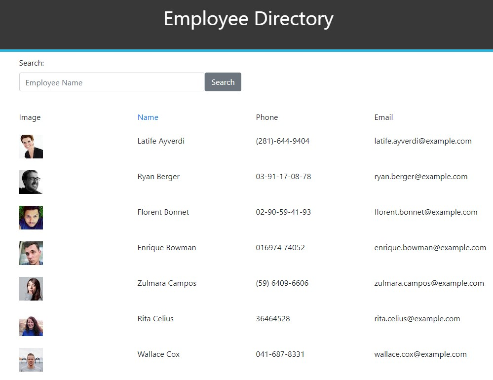

# Employee Directory

[](https://opensource.org/licenses/MIT)


## Description

An employee list, written in React.js, that displays a list of employees from the [Random User API](https://randomuser.me/) and allows them to be searched dynamically by name and also sorted by name.


## Table of Contents
  
  * [Installation](#installation)
  * [Testing](#testing)
  * [Useage](#useage)
  * [Technologies](#technologies)
  * [License](#license)
  * [Contact](#contact)
  * [Links](#links)


## Installation

'git clone' from [my repository](https://github.com/TimMartin13/employee-directory) and then open the terminal window and navigate to the employee-directory folder and Run

```
npm i
```
to install the all of the dependancies. Then type

```
npm start
```
into the terminal window to start the application.

## Testing

Vigorously, manually tested.


## Useage
The easy way: click on the deployed link in the Links section of this document, you will go to the website that looks like this:



Click on the Name column to sort by last name, it toggles between ascending and descending:


Or you can search for a certain employee by typing into the search text box, the list will be sorted dynamically as you type:


## Technologies

JavaScript, React, HTML, CSS, MongoDB, Heroku, MVC model 


## License

Licensed under the [MIT](https://choosealicense.com/licenses/mit/) license 


## Contact

Email: timmartin13@gmail.com

Github: [TimMartin13](https://github.com/TimMartin13)


## Links

Deployed link: https://timmartin13.github.io/employee-directory/

Repository link: https://github.com/TimMartin13/employee-directory

